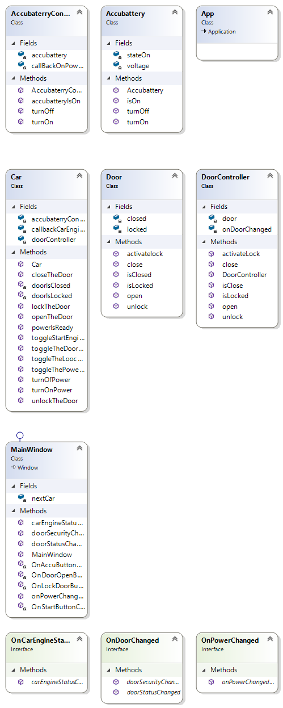

# TheNextCar
Modul 3

1. Class Diagram  

2. digunakan untuk mengolah data dari model Door.cs, karena ada beberapa function yang telah diset up untuk mengunci, membuka pintu dll
3. menyediakan data yang akan diolah oleh DoorController.cs seperti menutup atau mengunci pintu
4. untuk menampilkan pesan atau status dari pintu dan security

